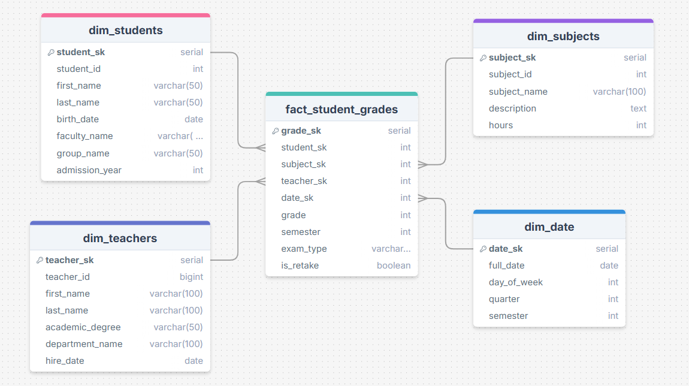

# Проектирование Data Warehouse для системы высшего образования

## Часть 1: Определение бизнес-процесса

Для проектирования Data Warehouse выбран бизнес-процесс: **"Академическая успеваемость студентов"**.
## Часть 2: Уровень детализации (Grain)

Уровень детализации определен как: **"Одна оценка, полученная одним студентом по одному предмету у одного преподавателя в определенный день и семестр"**.

## Часть 3: Таблицы измерений (Dimension Tables)

### 1. Таблица: dim_students (Измерение Студенты)
**Описание:** Содержит информацию о студентах для анализа успеваемости.

**Атрибуты:**
- student_sk: SERIAL, PRIMARY KEY, NOT NULL, UNIQUE
- student_id: INTEGER, NOT NULL, UNIQUE (business key)
- first_name: VARCHAR(50), NOT NULL
- last_name: VARCHAR(50), NOT NULL
- birth_date: DATE
- faculty_name: VARCHAR(100), NOT NULL
- group_name: VARCHAR(50), NOT NULL
- admission_year: INTEGER, NOT NULL

**Ограничения:**
- PK_dim_students: PRIMARY KEY (student_sk)
- CHK_admission_year: CHECK (admission_year BETWEEN 2000 AND EXTRACT(YEAR FROM CURRENT_DATE))

### 2. Таблица: dim_subjects (Измерение Предметы)
**Описание:** Содержит информацию об учебных предметах.

**Атрибуты:**
- subject_sk: SERIAL, PRIMARY KEY, NOT NULL, UNIQUE
- subject_id: INTEGER, NOT NULL, UNIQUE (business key)
- subject_name: VARCHAR(100), NOT NULL
- description: TEXT
- hours: INTEGER, NOT NULL

**Ограничения:**
- PK_dim_subjects: PRIMARY KEY (subject_sk)
- CHK_hours: CHECK (hours > 0)

### 3. Таблица: dim_teachers (Измерение Преподаватели)
**Описание:** Содержит информацию о преподавательском составе.

**Атрибуты:**
- teacher_sk: SERIAL, PRIMARY KEY, NOT NULL, UNIQUE
- teacher_id: INTEGER, NOT NULL, UNIQUE (business key)
- first_name: VARCHAR(50), NOT NULL
- last_name: VARCHAR(50), NOT NULL
- academic_degree: VARCHAR(50)
- department_name: VARCHAR(100), NOT NULL
- hire_date: DATE, NOT NULL

**Ограничения:**
- PK_dim_teachers: PRIMARY KEY (teacher_sk)
- CHK_hire_date: CHECK (hire_date <= CURRENT_DATE)

### 4. Таблица: dim_date (Измерение Дата)
**Описание:** Специальное измерение для временного анализа.

**Атрибуты:**
- date_sk: INTEGER, PRIMARY KEY, NOT NULL, UNIQUE (формат YYYYMMDD)
- full_date: DATE, NOT NULL
- day_of_week: INTEGER, NOT NULL
- quarter: INTEGER, NOT NULL
- semester: INTEGER, NOT NULL

**Ограничения:**
- PK_dim_date: PRIMARY KEY (date_sk)
- CHK_day_of_week: CHECK (day_of_week BETWEEN 1 AND 7)
- CHK_semester: CHECK (semester IN (1, 2))

## Часть 4: Таблица фактов (Fact Table)

### Таблица: fact_student_grades (Факты Успеваемости)
**Описание:** Содержит фактические данные об успеваемости студентов.

**Атрибуты:**
- grade_sk: SERIAL, PRIMARY KEY, NOT NULL, UNIQUE
- student_sk: INTEGER, FOREIGN KEY, NOT NULL
- subject_sk: INTEGER, FOREIGN KEY, NOT NULL
- teacher_sk: INTEGER, FOREIGN KEY, NOT NULL
- date_sk: INTEGER, FOREIGN KEY, NOT NULL
- grade: INTEGER, NOT NULL
- semester: INTEGER, NOT NULL
- exam_type: VARCHAR(50)
- is_retake: BOOLEAN, DEFAULT FALSE

**Ограничения:**
- PK_fact_student_grades: PRIMARY KEY (grade_sk)
- FK_fact_student_grades_students: FOREIGN KEY (student_sk) REFERENCES dim_students(student_sk)
- FK_fact_student_grades_subjects: FOREIGN KEY (subject_sk) REFERENCES dim_subjects(subject_sk)
- FK_fact_student_grades_teachers: FOREIGN KEY (teacher_sk) REFERENCES dim_teachers(teacher_sk)
- FK_fact_student_grades_date: FOREIGN KEY (date_sk) REFERENCES dim_date(date_sk)
- CHK_semester: CHECK (semester IN (1, 2))
- CHK_grade: CHECK (grade BETWEEN 1 AND 10)

**Метрики:** grade
**Атрибуты:** semester, is_retake

## Часть 5: Физическая модель (Star Schema)

## Часть 6: Аналитические запросы

1. **Средний балл по факультетам за последний семестр**
```
SELECT 
    ds.faculty_name,
    ROUND(AVG(fsg.grade), 2) AS average_grade,
    COUNT(fsg.grade_sk) AS number_of_grades,
    MIN(fsg.grade) AS min_grade,
    MAX(fsg.grade) AS max_grade
FROM fact_student_grades fsg
JOIN dim_students ds ON fsg.student_sk = ds.student_sk
JOIN dim_date dd ON fsg.date_sk = dd.date_sk
WHERE dd.semester = 2
GROUP BY ds.faculty_name
ORDER BY average_grade DESC;
```

2. **Динамика успеваемости по дням недели**
```
SELECT 
    dd.day_of_week,
    COUNT(fsg.grade_sk) AS grades_count,
    ROUND(AVG(fsg.grade), 2) AS average_grade,
    COUNT(DISTINCT fsg.student_sk) AS unique_students
FROM fact_student_grades fsg
JOIN dim_date dd ON fsg.date_sk = dd.date_sk
GROUP BY dd.day_of_week
ORDER BY dd.day_of_week;
```

3. **Успеваемость студентов по годам поступления**
```
SELECT 
    ds.admission_year,
    COUNT(fsg.grade_sk) AS total_grades,
    ROUND(AVG(fsg.grade), 2) AS average_grade,
    COUNT(DISTINCT fsg.student_sk) AS unique_students,
    COUNT(DISTINCT fsg.subject_sk) AS unique_subjects,
    MIN(fsg.grade) AS min_grade,
    MAX(fsg.grade) AS max_grade
FROM fact_student_grades fsg
JOIN dim_students ds ON fsg.student_sk = ds.student_sk
GROUP BY ds.admission_year
HAVING COUNT(fsg.grade_sk) > 5
ORDER BY ds.admission_year DESC;
```

4. Рейтинг предметов по средней успеваемости
```
SELECT 
    ds.subject_name,
    ds.hours,
    COUNT(fsg.grade_sk) AS grades_count,
    ROUND(AVG(fsg.grade), 2) AS average_grade,
    COUNT(DISTINCT fsg.student_sk) AS unique_students,
    MIN(fsg.grade) AS min_grade,
    MAX(fsg.grade) AS max_grade,
    ROUND(STDDEV(fsg.grade), 2) AS grade_std_dev
FROM fact_student_grades fsg
JOIN dim_subjects ds ON fsg.subject_sk = ds.subject_sk
GROUP BY ds.subject_name, ds.hours
HAVING COUNT(fsg.grade_sk) >= 3
ORDER BY average_grade DESC;
```
